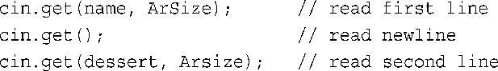

# CPlusPlus

Learning records and created based on the shifting stage of persona tech stack - from front-end to back-end.
This is more like a learning purpose repository usage, while noticed that the importance of computer operating logics, selected C++ as the language to get involved with this community. Personal Statement: Front-end based tech stack, while experienced a couple of failed interviews for the internship positions, made up my mind to learn back-end again. Re-pickup the back-end programming that lost in undergraduate period.

**I will divide the content into a menu form, based on the 'C++ Primier Plus 6th Edition' as the guidelines**

#### Chapter 2 - Start to learn C++

- 2.1 进入C++
  - 2.1.3节 C++预处理器和iostream文件
  - 2.1.6节 使用`cout`进行C++输出
    - `<<` **插入运算符** 表示该语句将把这个字符串发送给cout；该符号指出了信息流动的路径。
    - `cout`是一个预定义的**对象**，知道如何显示字符串、数字和单个字符等
- 2.4 函数
  - 不要混淆函数原型和函数定义。可以看出，原型只描述函数接口。也就是说，它描述的是发送给函数的信息和返回的信息。而定义中包含了函数的代码。

#### Chapter 3 - 处理数据

- 3.1 简单变量
  - 3.1.3 整型short、int、long和long long
    - 4种类型都是**符号类型**，意味着每种类型的取值范围中，负值和正值几乎相同。
    - C++工具来检查类型的长度：
      - `sizeof`运算符返回类型或变量的长度，单位为字节。对类型名（如int）使用sizeof运算符时，应将名称放在括号中`sizeof(int)`。对变量名使用sizeof运算符时，括号是可选的`sizeof n_short`
      - 头文件`climits`中包含了关于整型限制的信息
  - 3.1.4 无符号类型 **重点在于不能存储负数值** 要创建无符号版本的基本整形，使用关键字`unsigned`来修改声明即可
    - unsigned本身是unsigned int的缩写
    - C++确保了无符号类型的这种行为；但C++并不保证符号整型超越限制（上溢和下溢）时不出错。**见page 117**
  - 3.1.8 char类型
    - `cout.put()`方法 显示字符
    - signed char和unsigned char。unsigned char类型的表示范围通常为0～255，而signed char的表示范围为−128到127
    - **给char型变量赋值数字时，相当于char型已经变成了Int类型** 并且 **char型变量 只能和int型变量在有限范围内共通**
- 3.3 浮点数
  - C++有两种书写浮点数的方式：
    1. 使用常用的标准小数点表示法
    2. E表示法 **最适合于非常大和非常小的数** 举例：`3.45E6` 这指的是3.45与1000000相乘的结果; `E6`指的是10的6次方，`3.45E6`表示的是3450000，6被称为指数，3.45被称为尾数。
       1. **指数可以是正数也可以是负数** 指数为负数意味着除以10的乘方。例如`8.33E~4`表示`8.33/(10^4)`。`-8.33E4`指的是`-83300`, **前面的负号用于数值，而指数的负号用于缩放**
  - C++有三种浮点类型 **float, double, long double**

#### Chapter 4 - 复合类型
- 4.1 数组
  - 将sizeof运算符用于数组名，得到的将是整个数组中的字节数。但如果将sizeof用于数组元素，则得到的将是元素的长度（单位为字节）
- 4.2 字符串
  - 存储在连续字节中的一系列字符意味着可以将字符串存储在char数组中，其中每个字符都位于自己的数组元素中。
  - **字符串常量（使用双引号）不能与字符常量（使用单引号）互换** 举例说明，`char shirt_size = 'S'`'S'只是83的另一种写法，这就是将83赋给shirt_size。
  - 4.2.4 每次读取一行字符串输入 `getline()`和`get()`
    - `getline()`getline( )函数读取整行，它使用通过回车键输入的换行符来确定输入结尾。如果这个参数为20，则函数最多读取19个字符，余下的空间用于存储自动在结尾处添加的空字符。
    - `get()`与getline( )类似，但get并不再读取并丢弃换行符，而是将其留在输入队列中。使用不带任何参数的cin.get()调用 可读取下一个字符（即使是换行符，因此可以用它来处理换行符，为读取下一行输入做好准备。
    - **getline( )使用起来简单一些，但get( )使得检查错误更简单些**
- 4.4 结构简介
  - 4.4.5 结构数组 创建一个数组，里面的元素是一个个的结构。**创建的本身 是一个数组 而不是一个结构** 也就说明数组的每个index都是一个结构
- 4.6 枚举
  - 4.6.1 设置枚举量的值 
    - 可以使用赋值运算符来显式地设置枚举量的值。**指定的值必须是整数**
    - 也可以只显式地定义其中一些枚举量的值。`enum bigstep{first, second = 100, third}` first默认值是0，**后面没有被初始化的枚举量的值将比其前面的枚举量大1** third = 101
- 4.7 指针
  - 4.7.4 使用new来分配内存 **为一个数据对象获得并指定分配内存的通用格式**
  - 4.7.5 使用delete释放内存 **一定要配对地使用new和delete；否则将发生内存泄漏（memory leak）**
    - 只能用delete来释放使用new分配的内存。然而，对空指针使用delete是安全的。
#### 位运算符
